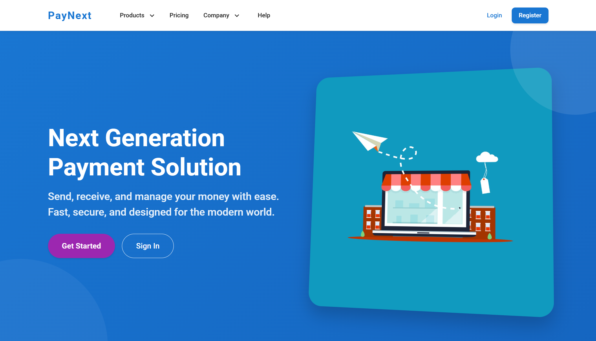

# PayNext


## Digital Payment Platform

PayNext is a payment processing platform built as genuine Java microservices: a Eureka service registry, a Spring Cloud Gateway, and independent user, payment, and notification services, all on Spring Boot 3.2 and Java 17. Alongside it, a separate set of 7 Python/FastAPI machine learning services (fraud detection, credit scoring, anomaly detection, churn prediction, transaction categorization, recommendations, and analytics) run as their own containers, though the gateway doesn't route to any of them yet, so they're reachable directly on their own ports rather than through the unified `/api` surface.

<div align="center">
  
</div>

## Table of Contents

- [Overview](#overview)
- [Project Structure](#project-structure)
- [Feature Status](#feature-status)
- [Technology Stack](#technology-stack)
- [Architecture](#architecture)
- [Installation and Setup](#installation-and-setup)
- [Running the Stack](#running-the-stack)
- [API Surface](#api-surface)
- [Testing](#testing)
- [CI/CD Pipeline](#cicd-pipeline)
- [Documentation](#documentation)
- [Contributing](#contributing)
- [License](#license)

## Overview

PayNext demonstrates a payment platform across a real, runnable set of Java microservices, backed by real integration and unit tests. Its API Gateway has explicit, documented routes for exactly three services: user, payment, and notification. The seven ML services are substantial and independently tested (fraud detection alone combines Isolation Forest, Random Forest, and a Keras autoencoder, publishing results to Kafka), but they're a separate, unrouted tier: none of the Java services call them, and the gateway doesn't expose them under `/api`.

## Project Structure

```
PayNext/
├── code/
│   ├── backend/                           # Java microservices (Maven multi-module)
│   │   ├── eureka-server/                 # Service registry
│   │   ├── api-gateway/                   # Spring Cloud Gateway, explicit routes for
│   │   │                                  # user/payment/notification under /api
│   │   ├── user-service/                  # Registration, login, profile
│   │   ├── payment-service/               # Payments, payment methods, balance
│   │   ├── notification-service/          # Sending notifications
│   │   └── common-module/                 # Shared library
│   ├── ml-services/                       # 7 independent Python/FastAPI services
│   │   ├── fraud-detection-service/       # Isolation Forest + Random Forest +
│   │   │                                  # Keras autoencoder, Kafka producer
│   │   ├── credit-scoring-service/
│   │   ├── anomaly-detection-service/
│   │   ├── churn-prediction-service/
│   │   ├── categorization-service/
│   │   ├── recommendation-service/
│   │   └── data-analytics-service/
│   └── docker-compose.yml                 # Full local stack: MySQL, Redis, Kafka,
│                                          # Zookeeper, all Java and ML services
├── web-frontend/                          # React (Create React App) dashboard
├── mobile-frontend/                       # React Native (Expo Router) app
├── infrastructure/                        # Docker, Kubernetes (with a real Helm chart),
│                                          # Terraform (AWS), Ansible, monitoring
├── scripts/                               # paynext.sh (build/start/stop/list backend
│                                          # services) and other setup/deploy scripts
├── docs/                                  # Documentation (this directory)
└── README.md
```

## Feature Status

### Application tier (wired and tested)

| Component                        | Details                                                                                                                                                                                                                                                                                                                                                            |
| :------------------------------- | :----------------------------------------------------------------------------------------------------------------------------------------------------------------------------------------------------------------------------------------------------------------------------------------------------------------------------------------------------------------- |
| **Service registry and gateway** | A real Eureka server, with a Spring Cloud Gateway that rewrites `/api/users/**`, `/api/payments/**`, and `/api/notifications/**` to their respective services via Eureka's load balancer.                                                                                                                                                                          |
| **User service**                 | Registration, login, JWT issuance, and profile management (`/users/register`, `/users/login`, `/users/me`, `/users/profile`).                                                                                                                                                                                                                                      |
| **Payment service**              | Initiating payments, listing payment methods, adding a payment method, checking balance, and payment requests (`/payments`, `/payments/methods`, `/payments/balance`, `/payments/requests`). It calls the user service directly (via a Feign-style client) rather than through a separate transaction service; there is no transaction service in this repository. |
| **Notification service**         | Sending a notification (`/notifications/send`).                                                                                                                                                                                                                                                                                                                    |
| **Auth**                         | JWT sessions issued by the user service. The signing key falls back to a placeholder value that's explicitly named to indicate it's for development only, if `JWT_SECRET` isn't set.                                                                                                                                                                               |
| **Resilience**                   | Circuit breaker configuration (Resilience4j) on the payment service's calls to the user service.                                                                                                                                                                                                                                                                   |
| **Web dashboard**                | React app (plain JavaScript, Create React App) with Material-UI and Framer Motion, covering the core payment, dashboard, and authentication screens.                                                                                                                                                                                                               |
| **Mobile app**                   | React Native (Expo Router, TypeScript) app with a barcode scanner and camera integration, using React Context (not Redux) for auth state.                                                                                                                                                                                                                          |

### ML services tier (real, independently deployed, not routed through the gateway)

| Component                      | Details                                                                                                                                                       |
| :----------------------------- | :------------------------------------------------------------------------------------------------------------------------------------------------------------ |
| **Fraud detection**            | Isolation Forest, Random Forest, and a Keras autoencoder, with its own database access, a cache layer, and a Kafka producer for publishing detection results. |
| **Credit scoring**             | A dedicated FastAPI service with its own model and API.                                                                                                       |
| **Anomaly detection**          | Includes its own synthetic data generator for training.                                                                                                       |
| **Churn prediction**           | Includes its own synthetic data generator for training.                                                                                                       |
| **Transaction categorization** | Includes its own synthetic data generator for training.                                                                                                       |
| **Recommendation service**     | A dedicated FastAPI service with its own model and API.                                                                                                       |
| **Data analytics**             | A dedicated FastAPI service for analytics queries.                                                                                                            |

Each of these runs as its own container in Docker Compose, on its own port, with a real FastAPI app and its own two-file test suite. None of the Java services currently call any of them.

## Technology Stack

| Area              | Technology                                                                              |
| :---------------- | :-------------------------------------------------------------------------------------- |
| Backend services  | Java 17, Spring Boot 3.2.0, Spring Cloud 2023.0.0, Maven (multi-module)                 |
| Service discovery | Netflix Eureka                                                                          |
| API Gateway       | Spring Cloud Gateway                                                                    |
| Resilience        | Resilience4j (circuit breakers)                                                         |
| Auth              | JJWT (JSON Web Tokens)                                                                  |
| Data layer        | MySQL, Redis                                                                            |
| Messaging         | Kafka (used by the fraud-detection service; no other service publishes to it)           |
| ML services       | Python, FastAPI, scikit-learn (Isolation Forest, Random Forest), TensorFlow/Keras       |
| API docs          | springdoc-openapi (Swagger UI on the gateway)                                           |
| Web frontend      | React 18, JavaScript, Create React App, Material-UI, Framer Motion, axios               |
| Mobile frontend   | React Native, Expo Router, TypeScript, React Context                                    |
| Infrastructure    | Docker, Docker Compose, Kubernetes (with a Helm chart), Terraform (AWS), Ansible        |
| CI/CD             | GitHub Actions                                                                          |
| Testing           | JUnit and Spring Boot Test (Java services), pytest (ML services), Jest (web and mobile) |

## Architecture

```
Clients
  ├── web-frontend (React)               ── HTTP/JSON ──┐
  └── mobile-frontend (React Native)     ── HTTP/JSON ──┤
                                                        ▼
API Gateway (Spring Cloud Gateway)
  /api/users/**          -> user-service
  /api/payments/**       -> payment-service
  /api/notifications/**  -> notification-service
  (routes resolved via Eureka; ML services are not routed here)

Java microservices (Spring Boot, registered with Eureka)
  user-service · payment-service (calls user-service) · notification-service
  Data layer: MySQL, Redis

ML services (Python / FastAPI, independent containers, called directly by port)
  fraud-detection-service (publishes to Kafka) · credit-scoring-service
  anomaly-detection-service · churn-prediction-service · categorization-service
  recommendation-service · data-analytics-service
```

See [docs/architecture.md](docs/architecture.md) for detail.

## Installation and Setup

Prerequisites: Java 17 and Maven, Node.js and npm, Python 3.11+, and Docker.

```bash
git clone https://github.com/quantsingularity/PayNext.git
cd PayNext

# Java backend
cd code/backend
mvn clean install
cd ../..

# ML services (each has its own requirements.txt)
for svc in code/ml-services/*/; do
  if [ -f "${svc}requirements.txt" ]; then
    pip install -r "${svc}requirements.txt"
  fi
done

# Web frontend
cd web-frontend && npm install && cd ..

# Mobile frontend
cd mobile-frontend && npm install && cd ..
```

Full, environment-specific instructions are in [docs/INSTALLATION.md](docs/INSTALLATION.md).

## Running the Stack

```bash
# Full local stack, including MySQL, Redis, Kafka, Zookeeper, and every
# Java and ML service (from code/, Docker required)
cd code
docker compose up -d

# Or run the Java services individually with the project script (from repo root)
./scripts/paynext.sh build
./scripts/paynext.sh start        # or: ./scripts/paynext.sh start payment-service
./scripts/paynext.sh list         # PIDs and status

# Web dashboard (from web-frontend)
npm start                          # http://localhost:3000

# Mobile app (from mobile-frontend)
npm start                          # press w for web, a for Android, i for iOS
```

**Access points:** Web dashboard at `http://localhost:3000`, API Gateway at `http://localhost:8080`, Swagger UI at `http://localhost:8080/swagger-ui.html`.

See [docs/USAGE.md](docs/USAGE.md) and [docs/CONFIGURATION.md](docs/CONFIGURATION.md).

## API Surface

Through the gateway, base URL `http://localhost:8080/api`. The ML services aren't behind the gateway; reach them on their own ports directly.

| Group         | Prefix               | Highlights                                                            |
| :------------ | :------------------- | :-------------------------------------------------------------------- |
| Users         | `/api/users`         | `register`, `login`, `me`, `profile` (get and update), `{id}`         |
| Payments      | `/api/payments`      | create, list, `balance`, `methods` (list and add), `requests`, `{id}` |
| Notifications | `/api/notifications` | `send`                                                                |

Full request and response shapes are in [docs/API.md](docs/API.md).

## Testing

```bash
# Java services (from code/backend)
mvn test

# A single ML service (from its own directory under code/ml-services)
pytest

# Web (from web-frontend)
npm test

# Mobile (from mobile-frontend)
npm test

# Everything, via the project script (from repo root)
./scripts/run_all_tests.sh
```

Each Java service has its own JUnit test suite (2 files for api-gateway, notification-service, payment-service, and user-service; 1 file each for eureka-server and common-module). Each of the 7 ML services has its own 2-file pytest suite. The web dashboard has 15 test files; the mobile app has 2.

## CI/CD Pipeline

GitHub Actions (`.github/workflows/cicd.yml`) runs four jobs on push, pull request, and manual dispatch:

| Job                 | Depends on          | What it does                                                              |
| :------------------ | :------------------ | :------------------------------------------------------------------------ |
| Code Quality Checks | -                   | Formatter checks across the repository                                    |
| Backend Build       | Code Quality Checks | `mvn clean install -DskipTests` and uploads the built JARs as an artifact |
| Backend Tests       | Backend Build       | `mvn test` and publishes a JUnit test report                              |
| Web Build           | Code Quality Checks | Builds the web frontend and uploads the build artifact (no test step)     |

There is currently no CI job for the ML services or the mobile app.

## Documentation

| Document                                           | Contents                               |
| :------------------------------------------------- | :------------------------------------- |
| [docs/README.md](docs/README.md)                   | Documentation index                    |
| [docs/architecture.md](docs/architecture.md)       | System architecture                    |
| [docs/API.md](docs/API.md)                         | REST API reference                     |
| [docs/INSTALLATION.md](docs/INSTALLATION.md)       | Setup for all components               |
| [docs/CONFIGURATION.md](docs/CONFIGURATION.md)     | Environment variables and config       |
| [docs/USAGE.md](docs/USAGE.md)                     | Running and using the platform         |
| [docs/CLI.md](docs/CLI.md)                         | Helper scripts reference               |
| [docs/FEATURE_MATRIX.md](docs/FEATURE_MATRIX.md)   | Feature status, implemented vs planned |
| [docs/TROUBLESHOOTING.md](docs/TROUBLESHOOTING.md) | Common issues and fixes                |
| [docs/CONTRIBUTING.md](docs/CONTRIBUTING.md)       | Contribution guide                     |
| [docs/examples/](docs/examples/)                   | Worked examples                        |

## Contributing

See [docs/CONTRIBUTING.md](docs/CONTRIBUTING.md).

## License

This project is licensed under the MIT License - see the [LICENSE](LICENSE) file for details.
